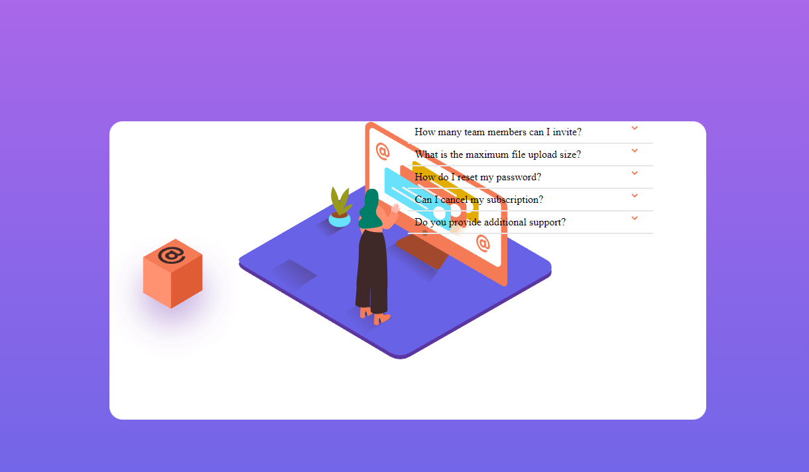

# Frontend Mentor - FAQ accordion card solution

This is a solution to the [FAQ accordion card challenge on Frontend Mentor](https://www.frontendmentor.io/challenges/faq-accordion-card-XlyjD0Oam). Frontend Mentor challenges help you improve your coding skills by building realistic projects. 

## Table of contents

- [Overview](#overview)
  - [The challenge](#the-challenge)
  - [Screenshot](#screenshot)
  - [Links](#links)
- [My process](#my-process)
  - [Built with](#built-with)
  - [What I learned](#what-i-learned)
  - [Continued development](#continued-development)
- [Author](#author)

**Note: Delete this note and update the table of contents based on what sections you keep.**

## Overview

### The challenge

Users should be able to:

- View the optimal layout for the component depending on their device's screen size
- See hover states for all interactive elements on the page
- Hide/Show the answer to a question when the question is clicked

### Screenshot

### Links

- Solution URL: [https://github.com/AndreDev21/FAQ-accordion-card]
- Live Site URL: [https://andredev21.github.io/FAQ-accordion-card/]

## My process

### Built with

- Semantic HTML5 markup
- CSS custom properties
- HTML details tag

### What I learned

learned how to use and style the details tag 
how to use css overflow properly
learned how to use the shadow-box element properly

### Continued development

still need to practice and learn a lot on how use only css an html

## Author

- Website - [https://andredev21.github.io/Portifolio/]
- Frontend Mentor - [https://www.frontendmentor.io/profile/AndreDev21]
- Twitter - [twitter.com/andre_martins03]